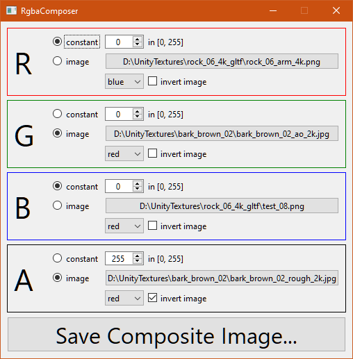

# RgbaComposer

A small Qt GUI application for extracting individual color channels from up to four existing images, and combining them as separate channels of a new image.
The original motivation was the creation of composite textures for Unreal engine; for example, combining the metal, AO, roughness, etc. channels into a single image.

